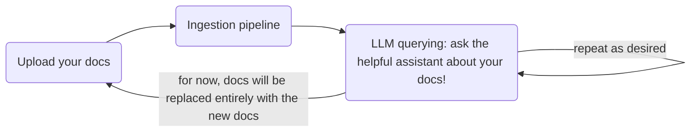
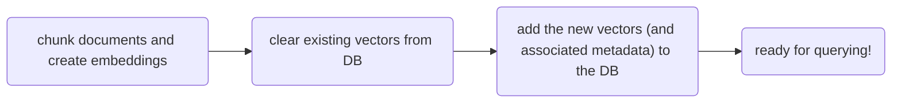
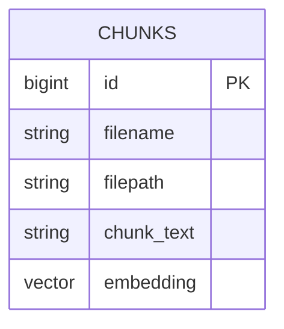

# yara: Yet Another RAG App

## Overview
`yara` is an assistant that helps answer questions about documents that you upload to it.

Currently supported docs:
1. Start with text only (markdown, txt, etc.)
2. Add PDF support if there's time

Here's the flow:

Here's some detail of the ingestion pipeline

## Database ERD

### Learning?!
This app is a learning project.

Learning objectives:
1. How to build a RAG app
2. Building an interactive CLI
3. Modular project architecture (without over-engineering)

## Architecture
The CLI should not be coupled with the underlying RAG functionality.

In the future I might want to add a Web UI instead of / in addition to the CLI.

Layers of the cake (tentative architecture):

CLI
/////////////////////////////////
Business logic
/////////////////////////////////
Database / API Adapters

## Database Setup
See [Docker setup](./docs/pgvector_docker_setup.md)

poetry add openai, python-dotenv, tiktoken, psycopg2-binary, langchain-experimental, docling

poetry add openai python-dotenv tiktoken psycopg2-binary langchain-experimental docling 