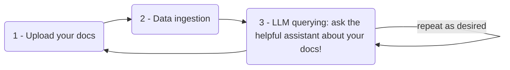
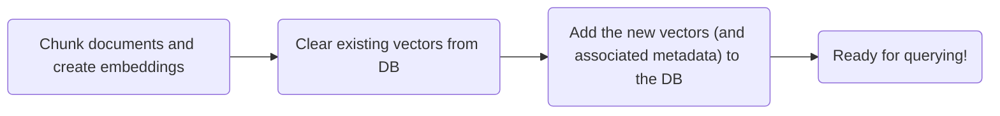
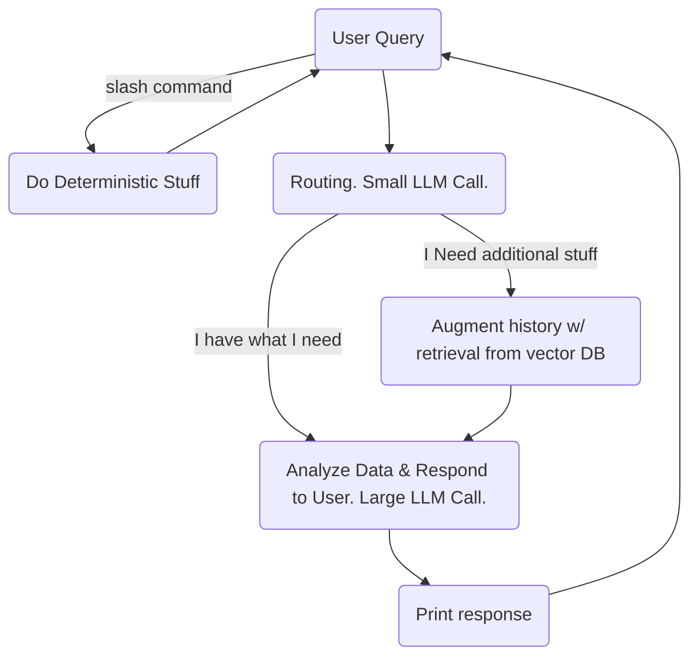
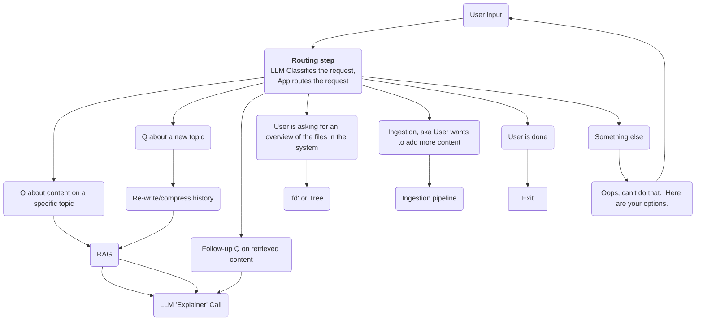
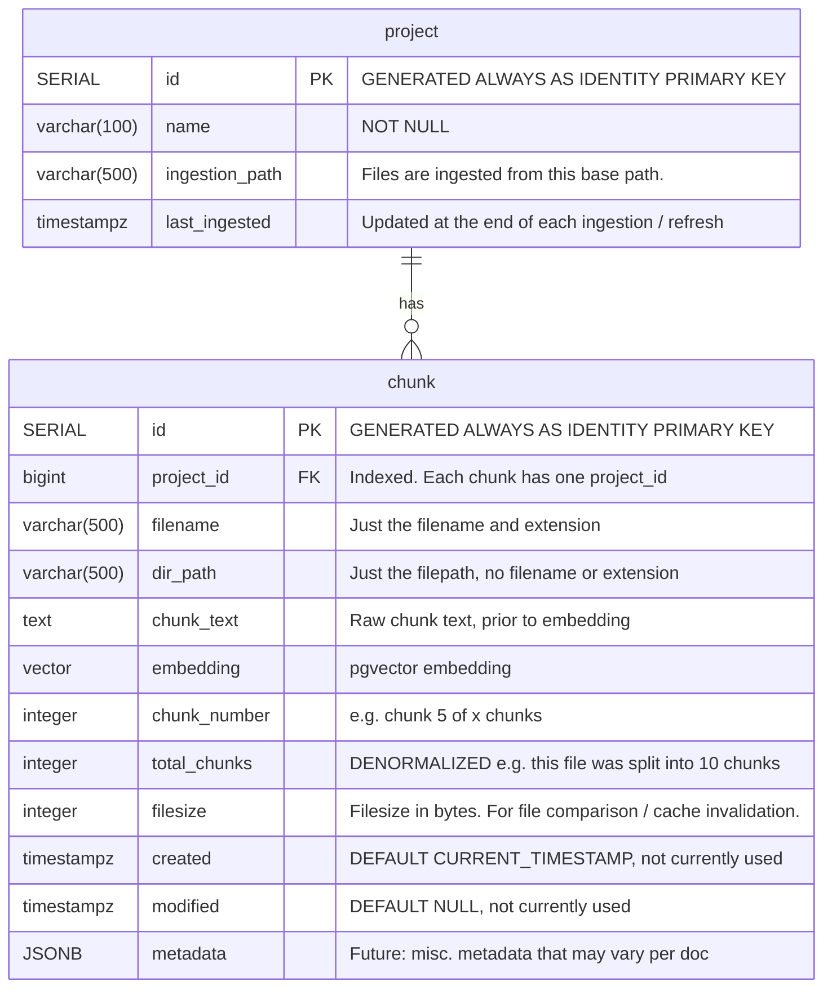

# yara (Yet Another RAG App)


## Overview
`yara` is an assistant that helps answer questions about documents that you feed it.

`yara` aims to be fast and simple. 

### Learning Goals
This app is a learning project.  I will avoid the use of frameworks that abstract away important RAG concepts and LLM interactions that I wish to learn.

Learning objectives:
1. How to build a RAG app
2. Building an interactive terminal UI
3. Modular project architecture (without over-engineering)
4. RAG methods like structured outputs, tool use, query classification

### Screenshots


### Limitations
Currently supported: text files (txt, md, json, etc.)

Future: PDF


## Getting started

Start Postgres & pgvector:
```bash
docker compose up -d
```

Verify that the DB was created and that you can connect to it:
```bash
docker compose exec db psql -U postgres -l
# or
psql -h localhost -p 8888 -U postgres
```

Setup tables in the database:
```bash
python -m yara.db.setup_db
```

If changes are made to the schema, you should do:
```bash
docker compose down -v  # removes volumes
# Also, re-do the setup steps listed above!
```

Activate the virtual environment and then start the app
```bash
eval $(poetry env activate)
python -m yara.main
```


## How it works
Here's the flow:



Here's some detail of the ingestion pipeline:




### A bit more detail
- **History** is augmented anytime responses are received from the User or the LLM.
- **Why is the routing step necessary?** There are scenarios where you don't want to retrieve data from the Vector DB, e.g. the user is asking a follow-up question about the data that was recently retrieved.  In this scenario, you wouldn't want the history/context being polluted with chunks that are unhelpful


### Routing / classification step
More detail on the 'Routing step' in the above diagram.  Routing logic is a placeholder at the moment.



## Architecture

Avoid:
- The CLI should not be coupled with the underlying RAG functionality. Why? In the future I might want to add a Web UI instead of / in addition to the CLI.


### Database ERD



### File storage
No file storage.  User gives Python a filepath that points to a file or folder.

Python will use that filepath to ingest the files into the DB, but it won't do anything with the original files, since the DB will contain everything we need to know about them.


## Run tests
```
poetry run pytest -v
```

## Docker setup details
More info, see [Docker setup](./docs/pgvector_docker_setup.md)