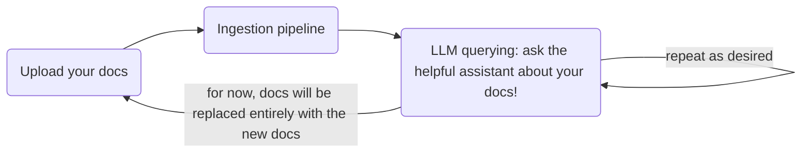
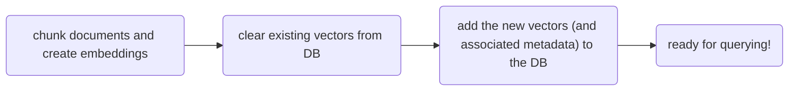
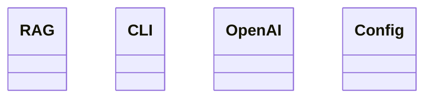
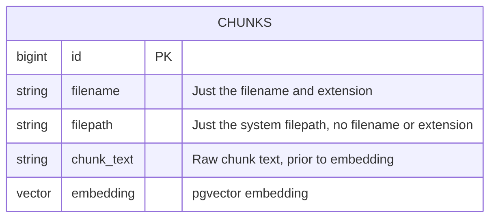

# yara: Yet Another RAG App

## Overview

`yara` is an assistant that helps answer questions about documents that you upload to it.

### Limitations

Currently supported docs:

1. Start with text only (markdown, txt, etc.)
2. Add PDF support if there's time

## Behaviors

Here's the flow:



Here's some detail of the ingestion pipeline:



## Learning Goals

This app is a learning project.  I will avoid the use of frameworks that abstract away important RAG concepts and LLM interactions that I wish to learn.

Learning objectives:

1. How to build a RAG app
2. Building an interactive CLI
3. Modular project architecture (without over-engineering)

## Architecture

Avoid:

- The CLI should not be coupled with the underlying RAG functionality. Why? In the future I might want to add a Web UI instead of / in addition to the CLI.

Layers of the cake (tentative architecture):

```
CLI
/////////////////////////////////
Business logic
/////////////////////////////////
Database / API Adapters
```

### v1

App logic:

- App: Main app logic
  - Dat Ingestion
  - Data Querying
- OpenAI: Makes API calls to OpenAI
- Config: loads environment vars

User interface:

- CLI: Invokes the application.  Orchestrates the CLI user experience

### v0



### Database ERD



### File storage

No file storage.  User gives Python a filepath that points to a file or folder.

Python will use that filepath to ingest the files into the DB, but it won't do anything with the original files, since the DB will contain everything we need to know about them.

More info: see [brianstorm](./docs/file-storage-brainstorm.md)

## Database Setup

See [Docker setup](./docs/pgvector_docker_setup.md)

poetry add openai, python-dotenv, tiktoken, psycopg2-binary, langchain-experimental, docling

poetry add openai python-dotenv tiktoken psycopg2-binary langchain-experimental docling
