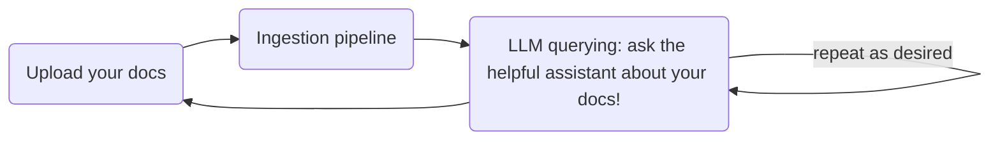
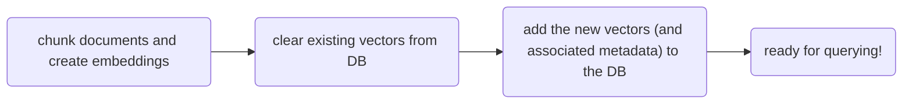
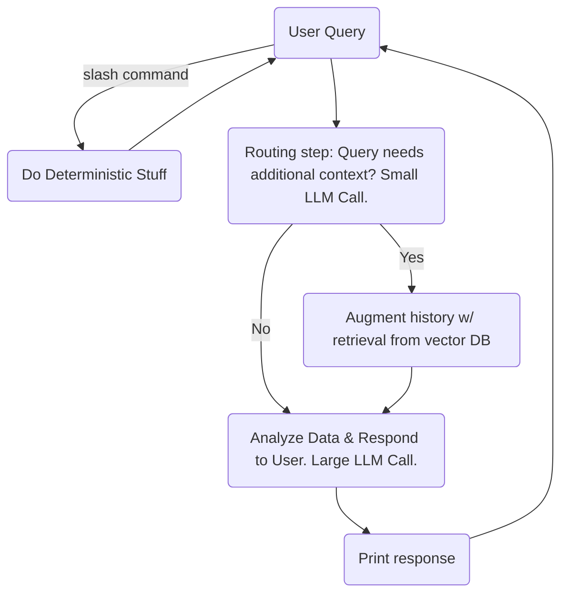
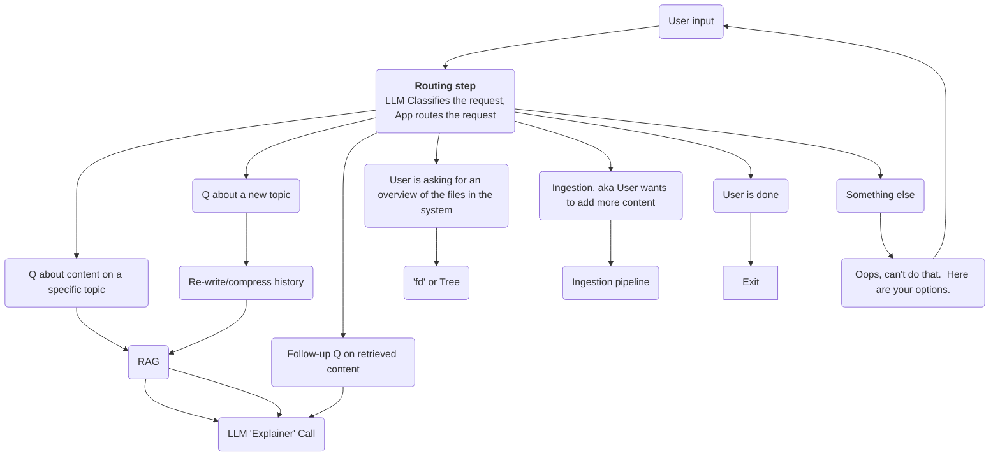
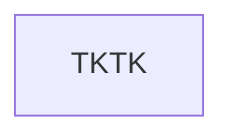
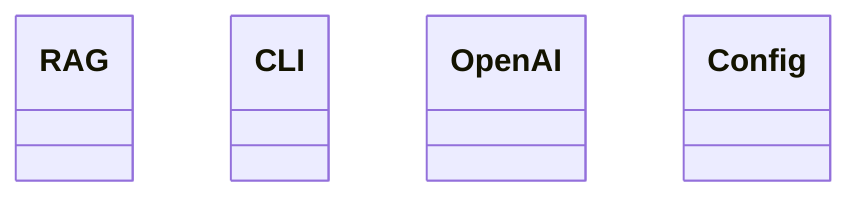
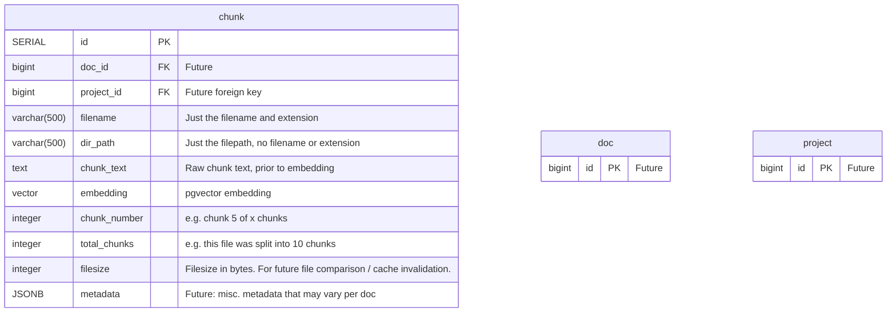

# yara (Yet Another RAG App)


## Overview

`yara` is an assistant that helps answer questions about documents that you feed it.

`yara` aims to be fast and simple. 

### Limitations

Currently supported docs:
1. Start with text only (markdown, txt, etc.)
2. Add PDF support if there's time

## Get started
See "Installation" below, activate the virtual environment, and then do:
```
python -m yara.main
```

## MVP Todo
- [ ] Backend (no fancy CLI)
	- [ ] Keyword querying of chunks in the DB (non-semantic, uses SQL queries)
		- [ ] SELECT * WHERE filename ILIKE {query}
	- [x] Semantic querying!?
		- [x] embed the query
		- [x] query the DB for similar vectors
		- [x] return the top_k matches
- [ ] Interactive CLI
	- [ ] LLM-powered question answering based on semantic query
		- [x] super basic - no classification - new context on every request - do the standard Wengrow loop
		- [ ] routing / classification step
			- [ ] question about new topic (retrieve!)
			- [ ] question about current topic (no retrieval)
		- [ ] LLM provides references to actual content:
			- relevant text excerpt
			- highlighted terms from user query
			- filename
	- [ ] ~~semantic query - return data in LLM-friendly format~~  Only do this if the LLM has trouble
	- [ ] Initiate ingestion
	- [ ] Smart ingestion - only re-ingest files that have changed
- [ ] Bonus points:
	- [ ] DB:
		- [ ] Create relationship between `chunk` and `file` instead of denormalizing data into each chunk.  
	- [ ] Cache ingestions to avoid re-embedding chunks that haven't changed

## Behaviors
Here's the flow:



Here's some detail of the ingestion pipeline:




## Flows

### A simple-ish RAG loop
Notes:
- **History** is augmented anytime responses are received from the User or the LLM.
- **Why is the routing step necessary?** There are scenarios where you don't want to retrieve data from the Vector DB, e.g. the user is asking a follow-up question about the data that was recently retrieved.  In this scenario, you wouldn't want the history/context being polluted with chunks that are unhelpful


### Routing / classification step
More detail on the 'Routing step' in the above diagram


### The "Agent Loop"
See Wengrow p.172

## Learning Goals

This app is a learning project.  I will avoid the use of frameworks that abstract away important RAG concepts and LLM interactions that I wish to learn.

Learning objectives:
1. How to build a RAG app
2. Building an interactive CLI
3. Modular project architecture (without over-engineering)
4. Advanced LLM methods like structured outputs, tool use, query classification

## Architecture

Avoid:
- The CLI should not be coupled with the underlying RAG functionality. Why? In the future I might want to add a Web UI instead of / in addition to the CLI.

### Layers of the cake (tentative architecture):
App logic:
- App: Main app logic
	- Data Ingestion
	- Data Querying
- OpenAI adapters - make calls to OpenAI
	- LLM
	- Embedding
- DB
	- pgvector - i/o with Postgres pgvector DB
- Config: loads environment vars

User interface:
- CLI: Invokes the application.  Orchestrates the CLI user experience

### Module Design (stub)



### Database ERD
Items marked as Future are NOT part of the MVP




### File storage
No file storage.  User gives Python a filepath that points to a file or folder.

Python will use that filepath to ingest the files into the DB, but it won't do anything with the original files, since the DB will contain everything we need to know about them.

More info: see [brianstorm](./docs/file-storage-brainstorm.md)

## Installation
Start Postgres:
```bash
docker compose up -d
```

Verify that the DB was created and that you can connect to it:
```bash
docker compose exec db psql -U postgres -l
# or
psql -h localhost -p 8888 -U postgres
```

Setup tables in the database:
```bash
python -m yara.db.setup_db
```

If changes are made to the schema, you should do:
```
docker compose down -v  # removes volumes

# Also, re-do the setup steps listed above!
```


More info, see [Docker setup](./docs/pgvector_docker_setup.md)