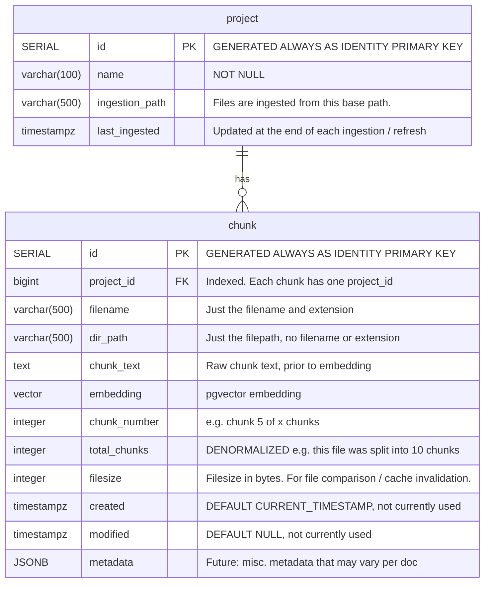

## Goal
Update the ERD to enable "Projects".  Each project will have an ingestion path.  The user can 'refresh' a project and re-injest the updated files (chunks) in that project.

Some details:
- Projects:
	- have a name and description
	- has an ingestion path (filepath) from which files are ingested
	- has a "last_ingested" date

## Usage context
More context on how the app is used can be provided, if helpful.

## New ERD
This is a sketch of my intent.  Some of the details may need to be updated to match best practices.

I need to audit setup() in /home/senorvalenz/projects/capstone/yara/src/yara/db/pgvector.py to determine what discrepancies exist.



## Modifications

### /home/senorvalenz/projects/capstone/yara/src/yara/db/pgvector.py
#### `insert_chunks()` 
has been modified to remove the default project_id.  This was a placeholder during prototyping.

Code that took advantage of this default value may be lingering in the codebase.

#### Various functions
Should be updated with a project_id parameter.  For example: `get_similar_chunks()` should only return similar chunks that use the SAME project_id.  Why? If a user asks a question about a project, they woudln't want chunks from another project turning up in their results! 


## CLAUDE PLAN

### Gaps (not in the doc above)

These functions also need updating:

| Function | File | Issue |
|---|---|---|
| `get_ingested_files(dir_path)` | `db/pgvector.py:147` | No project_id filter — two projects sharing a dir would collide |
| `purge_stale_files(directory_path)` | `services/ingest.py:172` | Calls `get_ingested_files` without project_id |
| `delete_chunks_for_file(dir_path, filename)` | `db/pgvector.py:161` | No project_id scope — could delete chunks from other projects if filenames collide |
| `query_similar_chunks(query_text, top_k)` | `services/get_chunks.py:14` | Wraps `get_similar_chunks`; needs project_id passed through |
| `rag_request(conversation)` | `services/handlers.py:34` | Calls `query_similar_chunks` without project_id |
| `get_max_project_id()` | `db/pgvector.py:132` | Stopgap hack — replace with project table lookup |
| `setup()` | `db/pgvector.py:68` | Must create `project` table and add FK on `chunk.project_id` |
| `nuke()` | `db/pgvector.py:44` | Must drop `project` table too (chunk first, then project) |
| `ingest.py __main__` | `services/ingest.py:279` | Uses `get_max_project_id()` — needs updating |

### Implementation Phases

---

#### Phase 1 — DB schema (`db/pgvector.py` only)

Foundation. Everything else depends on this.

**1a. `setup()` — line 68**
Create `project` table **before** `chunk`. Add FK on `chunk.project_id → project.id`.
```sql
CREATE TABLE IF NOT EXISTS project (
    id BIGINT GENERATED ALWAYS AS IDENTITY PRIMARY KEY,
    name VARCHAR(100) NOT NULL,
    ingestion_path VARCHAR(500) NOT NULL,
    last_ingested TIMESTAMPTZ DEFAULT NULL
);
-- chunk table gets: project_id BIGINT NOT NULL REFERENCES project(id)
```

**1b. `nuke()` — line 44**
Drop `chunk` first (FK dependent), then `project`.

**1c. `get_similar_chunks()` — line 115**
Add `project_id: int` param. Add `WHERE project_id = %s` before `ORDER BY`.

**1d. `get_ingested_files()` — line 147**
Add `project_id: int` param. Add `AND project_id = %s` to the WHERE clause.

**1e. `delete_chunks_for_file()` — line 161**
Add `project_id: int` param. Add `AND project_id = %s` to the DELETE.

**1f. Remove `get_max_project_id()` — line 132**
Stopgap hack. Once the project table exists, project_id comes from a real project row.

**Verify Phase 1:** `python -m yara.db.setup_db` creates both tables without errors. `nuke()` drops both cleanly.

---

#### Phase 2 — Ingest pipeline (`services/ingest.py`)

**2a. `purge_stale_files()` — line 172**
Pass `project_id` through to `get_ingested_files()` and `delete_chunks_for_file()`.

**2b. `__main__` block — line 271**
Replace `get_max_project_id()` with a lookup (or insert) against the `project` table.

**Verify Phase 2:** Ingest a dir under project A. Confirm `get_ingested_files(dir, project_id_A)` only returns project A files. Ingest under project B — confirm no cross-contamination.

---

#### Phase 3 — Query/retrieval layer (`get_chunks.py`, `handlers.py`, `Conversation`)

**3a. `query_similar_chunks()` — `services/get_chunks.py:14`**
Add `project_id: int` param, pass to `get_similar_chunks()`.

**3b. Store `project_id` on `Conversation`**
Set once at session startup when the user selects a project.

**3c. `rag_request()` — `services/handlers.py:34`**
Read `conversation.project_id`, pass explicitly to `query_similar_chunks(query, top_k, project_id=...)`.

`query_similar_chunks()` and `get_similar_chunks()` remain plain `int` params — decoupled from `Conversation`, easy to test independently.

**Verify Phase 3:** Ask a question scoped to project A — confirm only project A chunks appear in the response.
