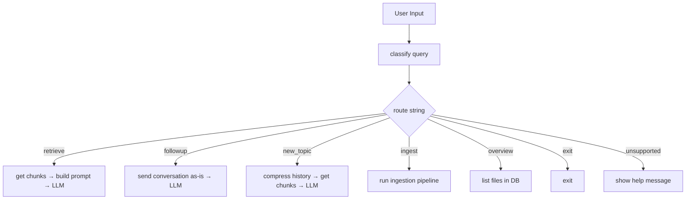
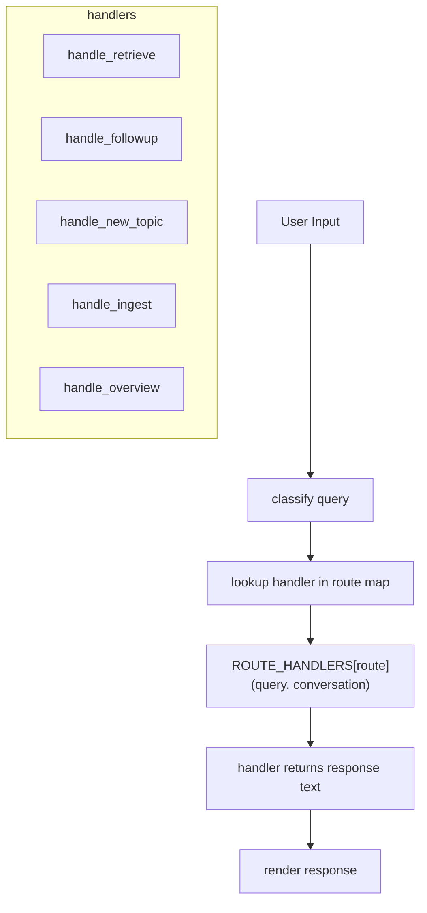
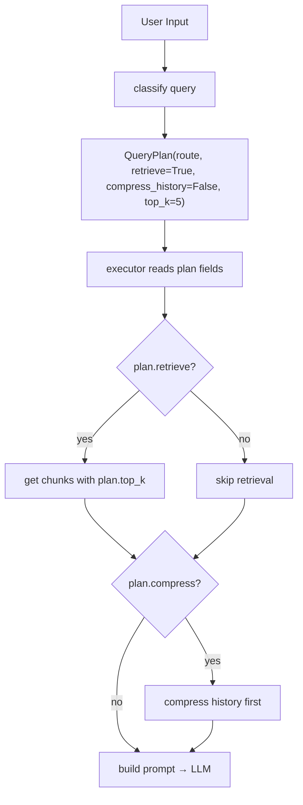
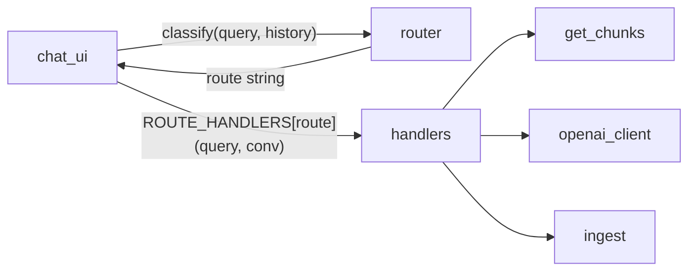

Author: Claude

# Routing Brainstorm: LLM-as-Classifier

## Goal

Before every retrieval step, classify the user's query so the app can take the right action — retrieve chunks, reply from context, trigger ingestion, etc.

## Routes (from routing.mermaid)

| Route | Action |
|-------|--------|
| `retrieve` | Embed query, search pgvector, inject chunks into LLM prompt |
| `followup` | Skip retrieval — answer from conversation history |
| `new_topic` | Compress/rewrite history, then retrieve |
| `overview` | List files/content in the system (tree / fd) |
| `ingest` | Trigger the ingestion pipeline |
| `exit` | End session |
| `unsupported` | Explain what the app can do |

---

## High-Level Approaches

All three use the same core idea — send the query + recent history to the LLM and ask it to return a route string — but differ in **where** the classification happens and **how** it connects to the rest of the app.

### Option A: Classify-Then-Branch (Simple If/Else)

The classifier is a standalone function that returns a string. The chat loop uses a plain `if/elif` block to branch.



**How it works:**
1. `router.py` exposes `classify(query, history) -> str`
2. Internally it makes a single LLM call with a classification prompt
3. `chat_ui.py` calls `classify()`, then branches with `if route == "retrieve": ...`

**Pros:** Dead simple, easy to debug, minimal abstraction
**Cons:** Chat loop grows as you add routes; classification + action are coupled in one function

---

### Option B: Route-to-Handler Map (Strategy Pattern)

Each route maps to a handler function. The chat loop stays thin — it classifies, looks up the handler, and calls it.



**How it works:**
1. `router.py` exposes `classify(query, history) -> str` (same as Option A)
2. A dict maps route strings to handler functions:
   ```python
   ROUTE_HANDLERS = {
       "retrieve": handle_retrieve,
       "followup": handle_followup,
       "new_topic": handle_new_topic,
       ...
   }
   ```
3. Chat loop becomes: `handler = ROUTE_HANDLERS[route]` then `handler(query, conversation)`

**Pros:** Chat loop stays small, easy to add/remove routes, handlers are testable in isolation
**Cons:** Slightly more structure to set up upfront

---

### Option C: Classifier Returns a Plan (Structured Output)

Instead of returning just a route string, the classifier returns a structured object describing **what to do** — e.g., whether to retrieve, how many chunks, whether to compress history first.



**How it works:**
1. `router.py` exposes `classify(query, history) -> QueryPlan`
2. The LLM returns JSON (or you parse structured output) with fields like:
   ```python
   @dataclass
   class QueryPlan:
       route: str
       retrieve: bool
       compress_history: bool
       top_k: int = 5
   ```
3. An executor function interprets the plan and assembles the pipeline

**Pros:** Most flexible, LLM can make nuanced decisions (e.g., "retrieve but only 3 chunks"), composable
**Cons:** More complex, harder to debug, structured output parsing can be fragile

---

## Comparison

| | Simplicity | Flexibility | Testability | Chat loop complexity |
|---|---|---|---|---|
| **A: If/Else** | Best | Limited | Moderate | Grows with routes |
| **B: Handler Map** | Good | Good | Best | Stays small |
| **C: Structured Plan** | Most complex | Best | Moderate | Stays small |

## Recommendation

**Start with Option A**, get it working, then refactor toward Option B when the if/elif block gets unwieldy. Option C is overkill until you need per-query tuning (like variable top_k).

The classifier prompt itself is the same regardless of option — the difference is just how the chat loop consumes the result.

---

## Classifier Prompt Sketch

```
You are a query classifier for a document Q&A system.

Given the user's query and recent conversation history, classify the query
into exactly one of these categories:

- retrieve: user is asking about a topic that requires searching the document database
- followup: user is continuing a conversation about already-retrieved content
- new_topic: user is switching to a completely different topic (needs fresh retrieval + history compression)
- overview: user wants to see what files/content are available
- ingest: user wants to add new documents to the system
- exit: user wants to end the session
- unsupported: user is asking for something outside the system's capabilities

Respond with ONLY the category name, nothing else.
```

---

## Chosen Approach: Option B — Module Structure

### File Layout

```
src/yara/
├── cli/
│   └── chat_ui.py          # chat loop — calls classify(), dispatches to handler, renders output
│
├── services/
│   ├── router.py            # classify(query, history) → route string + ROUTE_HANDLERS map
│   ├── handlers.py          # handler functions: handle_retrieve, handle_followup, etc.
│   ├── get_chunks.py        # semantic retrieval (already exists)
│   ├── openai_client.py     # shared LLM client (already exists)
│   ├── openai_embedding.py  # embeddings (already exists)
│   └── ingest.py            # ingestion pipeline (already exists)
│
└── db/
    └── pgvector.py          # DB operations (already exists)
```

### Module Responsibilities

| Module | Owns | Knows about |
|--------|------|-------------|
| `router.py` | `classify()`, `ROUTE_HANDLERS` dict | openai_client, handlers |
| `handlers.py` | One function per route, each takes `(query, conversation)` and returns response text | get_chunks, openai_client, ingest |
| `chat_ui.py` | Input, rendering, conversation list | router (and nothing else) |

### Key Boundary

`chat_ui.py` never imports `get_chunks` or `openai_client` directly. It calls `classify()` to get the route, looks up the handler from `ROUTE_HANDLERS`, calls it, and renders the result. All RAG/LLM logic lives in `handlers.py`.



### Why `handlers.py` Is Separate from `router.py`

The classifier calls the LLM to decide a route. The handlers call the LLM to generate answers. Keeping them apart avoids a circular mess where classification and execution are tangled together — and lets you test/iterate on handlers without touching the classifier.

## Next Steps

1. Implement `classify()` in `router.py` with the classifier prompt above
2. Create `handlers.py` with handler functions for each route
3. Wire `chat_ui.py` to use `classify()` + `ROUTE_HANDLERS` dispatch
4. Test with a handful of queries to see if classification is accurate
5. Iterate on the classifier prompt to handle edge cases
