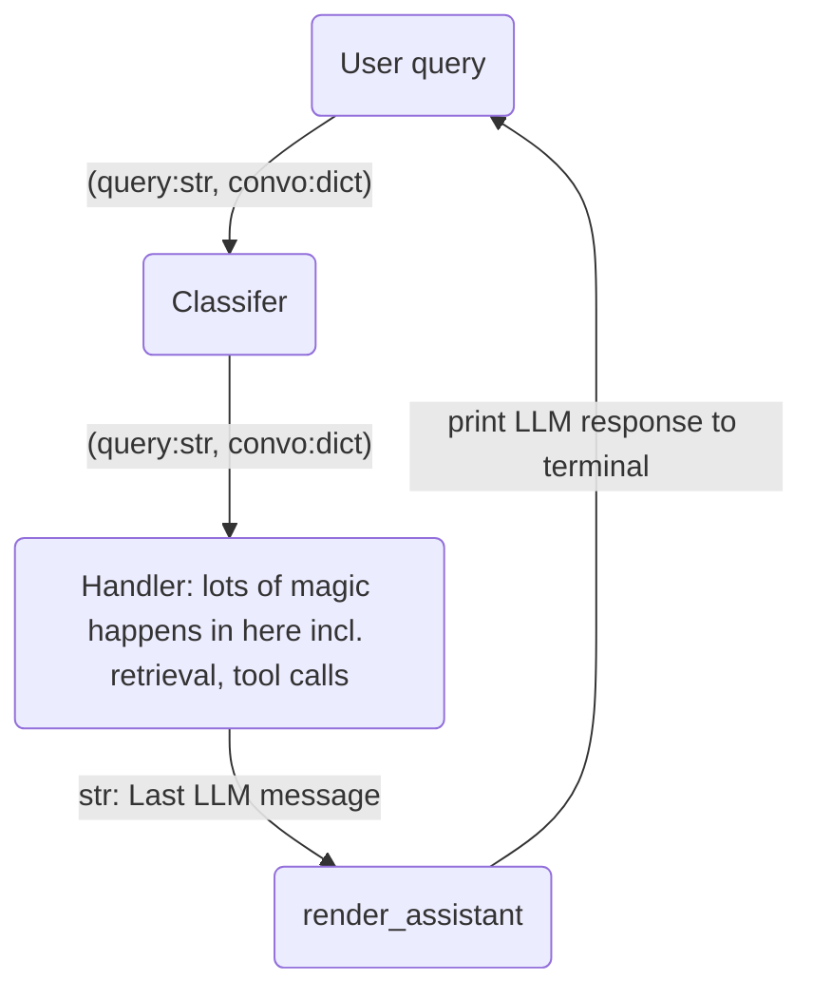
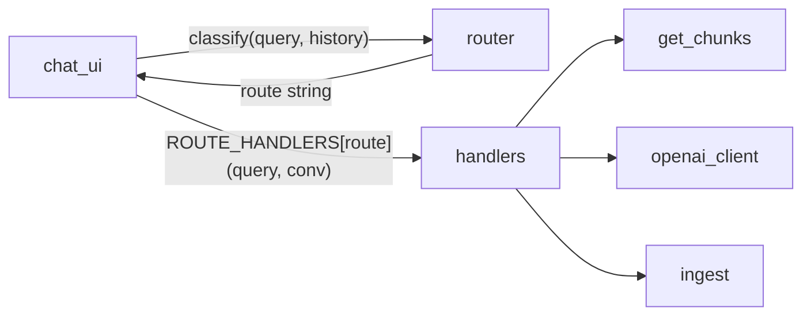

## Done
### Layers of the cake (tentative architecture):
App logic:
- App: Main app logic
	- Data Ingestion
	- Data Querying
- OpenAI adapters - make calls to OpenAI
	- LLM
	- Embedding
- DB
	- pgvector - i/o with Postgres pgvector DB
- Config: loads environment vars

User interface:
- CLI: Invokes the application.  Orchestrates the CLI user experience

### Routing

Rough execution plan: Extracting router and handlers from main loop

How do the python modules interact with each other?

